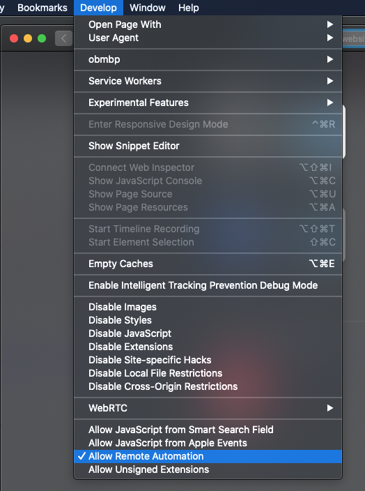

# Vagrant webdriver collection 

Inspired by https://github.com/jonashackt/vagrant-macosx/blob/master/Vagrantfile
See also https://github.com/bacongravy/macinbox

## Including VMS of:
* macos mojave with Safari 12 (Must run on macos host (?))
* windows 10 with Edge 18
Batteries included to run selenium tests on them!

The webdriver-manager is set to start automatically. the 4444 port is forwarded to your host machine. 

You may choose which vms you want to create and use. don't just run `vagrant up`, but `vagrant boxname`

Vagrant is a cli tool/framework to automate vms on various providers. on our case: virtualbox!

The macbox is huge! 13GB. and the S3 it's on is very slow. please be patient when you start it on the first time. 
The windows 10 is "just" 9GB. and the S3 it's on is very slow. please be patient when you start it on the first time. 

## Prerequisites
* lots of free disk space (20GB+ per vm you want to use)
* Be on macos
* Install virtualbox & virtualbox-extension-pack (`brew cask install virtualbox` &&  `brew cask install virtualbox-extension-pack`)
* Install vagrant (`brew cask install vagrant`)

The password for the users is always `vagrant`  
On the guests vms the `/vagrant` path is mapped to the current directory

To ssh the machines: `vagrant ssh 'vmname'`  
If you want to run webdriver-manager from ssh, you might need to force interactive shell 
To see the ips of the vms: ... TBD

And you can also access the vms ui via virtualbox ui!

## Safari (12.1.2, chrome, ff on Mojave)
`vagrant up macos`;   
The port is: 5444 (`http://localhost:5444/wd/hub`)  
you will might need to type your root password to complete.  
And you will need to manually enable remote automation option:  

webdriver port: 5444

What's the `webdriver-manager_start.app` is for? https://stackoverflow.com/a/48268988/711152   

## Edge
`vagrant up win10`;   
webdriver port: 6444

Basic selenium node project to test it with:
[try_it_script/try_it.js](try_it_script/try_it.js) 

More vagrant commnads:
* `vagrant up [boxname]`
* `vagrant suspend [boxname]`
* `vagrant halt [boxname]`
* `vagrant destroy [boxname]`
